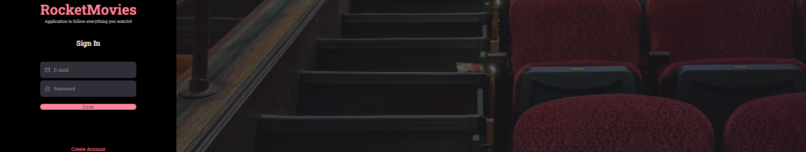

#### MovieRocket-ReactJS_Vite_St9
### The same project study track: Rocketseat_Explorer_ReactJS_Vite_St9_Notes

### Stage 9 => Learning to create an application to manage movies and useful links.

 

## 🛫 Stage 09 => Learning: ReactJS , Vite e frontend

# Introduction: Learning:
The same project study track:
Rocketseat_Explorer_ReactJS_Vite_St9_Notes

#### Every project carried out with the accompaniment of the Explorer Rocketseat project.

## Project Lay-out: Figma

[Lay-out: Figma - Docs](https://www.figma.com/file/xjeQU6sY9zeTLUzbMUAOJG/RocketMovies-(Copy)?node-id=304%3A53&t=pzGAyFVlDjn7h4Ci-0)

<h2 align="center">To make this Stage 9 I used 👇</h2>

   
 

----------------------

### Contact

### [**Luciana Diemert**](https://github.com/ludiemert)

🛠 `Junior Web Developer | HTML | CSS | JavaScript | ReactJS | NodeJS | Full Stack` Developer Jr.  
📍 São Jose dos Campos – SP - Brazil

&nbsp;
&nbsp;
&nbsp;
&nbsp;

 

------------------
## 🎁 Acknowledgements and dedications

* Thank you #Rocketseat team
